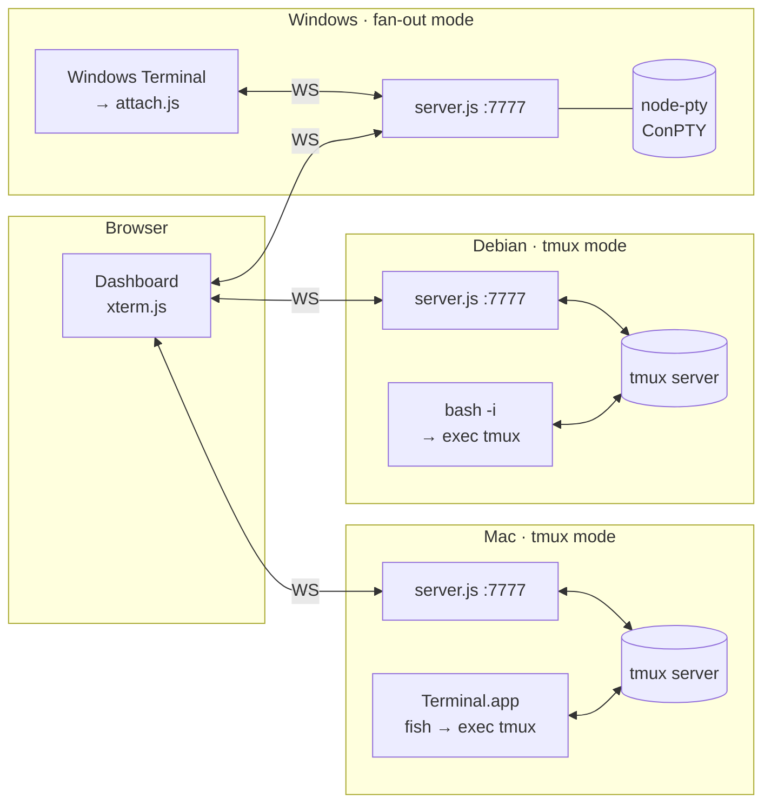

# term-hub

> **One web page. Every terminal you own. From anywhere.**

```
  ┌─────────┐      ┌────────────┐      ┌─────────┐
  │  Mac    │◀────▶│  Dashboard │◀────▶│  Linux  │
  └─────────┘  WS  │  (browser) │  WS  └─────────┘
                   └─────┬──────┘
                         │  WS
                   ┌─────▼──────┐
                   │  Windows   │
                   └────────────┘
```

term-hub is a tiny Node server that exposes your local terminals over the web.
Every box on your home LAN runs the same 300-line `server.js`; your browser shows
them all in one dashboard, with real-time multi-client mirroring, tmux integration,
and a universal attach CLI for the non-tmux crowd (Windows, BSD, minimal images).

Built it because I kept copy-pasting prompts between two Macs, a Linux box, and a
Windows desktop. Now I don't.

---

## Highlights

- **Self-contained**: one `node server.js`, no database, no build step, no React.
- **tmux-aware**: on Linux/macOS, sessions are real tmux sessions — attach from
  the native Terminal.app *and* the web at the same time, fully in sync.
- **Fan-out mode**: on Windows (no tmux), the hub holds the PTY and broadcasts
  to every client, with a 256KB ring buffer so late joiners see recent output.
- **Aggregated dashboard**: one page lists every host, every session; click to
  open, drag tabs, paste across machines.
- **Auto-attach**: shell init hook (fish / bash) puts every new terminal window
  into a uniquely-named tmux session, so the dashboard picks it up automatically.
- **Universal attach CLI**: `node attach.js http://hub:7777` turns any terminal
  (PowerShell, cmd, xterm) into a thin client with `Ctrl-] q` to detach.
- **Offline-safe**: your local terminals work the same when you leave the LAN;
  only the remote-host tabs show as offline.

---

## Architecture



**Two modes, same protocol.** Each WebSocket carries raw PTY bytes plus a tiny
JSON sidechannel for `resize` / `ready` / `exit`. Mode is picked per host:

| Mode      | When                   | Storage         | Multi-client | Survives hub restart |
|-----------|------------------------|-----------------|--------------|----------------------|
| `tmux`    | tmux is installed      | tmux server     | native       | yes                  |
| `fanout`  | no tmux (e.g. Windows) | in-memory PTY   | broadcast    | no                   |

---

## Quick Start

### Mac / Linux

```bash
git clone https://github.com/quake0day/term-hub.git
cd term-hub
npm install
# tmux is optional but recommended
brew install tmux          # macOS
sudo apt install tmux      # Debian/Ubuntu
node server.js             # listens on 0.0.0.0:7777
```

Open `http://localhost:7777`. Done.

### Auto-attach every new shell window (recommended)

The magic trick: let your shell automatically wrap itself in a named tmux
session, so every Terminal window shows up in the dashboard and can be
mirrored/controlled from the browser.

**fish** — append to `~/.config/fish/conf.d/term-hub.fish`:

```fish
if status is-interactive
    and not set -q TMUX
    and not set -q TERM_HUB_SKIP
    and type -q tmux
    set -l n 1
    while tmux has-session -t "mac-$n" 2>/dev/null
        set n (math $n + 1)
    end
    exec tmux new-session -A -s "mac-$n"
end
```

**bash** — append to `~/.bashrc`:

```bash
if [[ $- == *i* ]] && [[ -z "$TMUX" ]] && [[ -z "$TERM_HUB_SKIP" ]] && command -v tmux >/dev/null; then
  __p="$(hostname -s)"; __n=1
  while tmux has-session -t "${__p}-${__n}" 2>/dev/null; do __n=$((__n+1)); done
  exec tmux new-session -A -s "${__p}-${__n}"
fi
```

Recommended `~/.tmux.conf` to keep the native look & feel:

```
set -g status off
set -g mouse on
set -g history-limit 50000
set -g window-size latest
setw -g aggressive-resize on
```

Opt out for a single shell with `TERM_HUB_SKIP=1 bash -i` (or `fish`).

### Linux — run as a systemd service

```ini
# /etc/systemd/system/term-hub.service
[Unit]
Description=term-hub
After=network.target

[Service]
User=you
WorkingDirectory=/home/you/term-hub
Environment=PORT=7777
Environment=HOST=0.0.0.0
ExecStart=/usr/bin/node /home/you/term-hub/server.js
Restart=on-failure

[Install]
WantedBy=multi-user.target
```

```bash
sudo systemctl enable --now term-hub
```

### Windows

```powershell
winget install OpenJS.NodeJS.LTS
git clone https://github.com/quake0day/term-hub.git C:\term-hub
cd C:\term-hub
npm install --omit=dev
$env:PORT=7777; node server.js     # boots in fan-out mode
```

Then set Windows Terminal's **default profile** so every new tab registers
itself with the hub:

```json
{
  "name": "Hub PowerShell",
  "commandline": "node.exe C:\\term-hub\\attach.js http://localhost:7777",
  "startingDirectory": "%USERPROFILE%"
}
```

Each new window auto-picks `<hostname>-1`, `<hostname>-2`, … and streams
bidirectionally to the hub. `Ctrl-]` then `q` detaches without killing the
session (it lives on in the hub until you close it from the web).

For auto-start on boot, use [NSSM](https://nssm.cc):

```powershell
nssm install term-hub "C:\Program Files\nodejs\node.exe" C:\term-hub\server.js
nssm start term-hub
```

---

## Aggregated Dashboard

Drop a `hosts.json` in the repo root on **each** machine:

```jsonc
// mac's hosts.json — its own entry uses "" = same origin as the page
[
  { "name": "mac",    "url": "" },
  { "name": "server", "url": "http://10.0.0.2:7777" },
  { "name": "win",    "url": "http://10.0.0.3:7777" }
]
```

```jsonc
// server's hosts.json — mirror image
[
  { "name": "mac",    "url": "http://10.0.0.1:7777" },
  { "name": "server", "url": "" },
  { "name": "win",    "url": "http://10.0.0.3:7777" }
]
```

The `""` (empty-url) trick means "whichever URL the dashboard itself was
loaded from" — so opening the dashboard via `localhost`, LAN IP, or a VPN
hostname all Just Work without editing config. Offline hosts show a red dot
and a clear error; your local sessions keep working.

---

## `attach.js` — universal thin client

```
node attach.js [hubURL] [session]

  hubURL   default: $TERM_HUB_URL or http://localhost:7777
  session  default: next free "<hostname>-N" on the hub
```

Env knobs:

| Var                | Effect                                       |
|--------------------|----------------------------------------------|
| `TERM_HUB_URL`     | Default hub URL                              |
| `TERM_HUB_SESSION` | Force a specific session name                |
| `TERM_HUB_PREFIX`  | Override `<hostname>` in auto-naming         |

Inside the attached session:

- All keystrokes stream to the remote PTY (raw mode).
- **`Ctrl-]` then `q`** — detach cleanly. Session keeps running on the hub.
- `Ctrl-C`, resize, etc. are forwarded transparently.

Works on macOS, Linux, Windows — any Node 18+ box.

---

## Configuration reference

| Env var              | Default       | Notes                                                      |
|----------------------|---------------|------------------------------------------------------------|
| `PORT`               | `3000`        | HTTP + WebSocket port                                      |
| `HOST`               | `0.0.0.0`     | Bind address; set `127.0.0.1` for localhost-only           |
| `TMUX_BIN`           | auto-detect   | Explicit path to tmux binary                               |
| `TERM_HUB_NO_TMUX`   | _unset_       | Force fan-out mode even if tmux exists (useful for tests)  |
| `TERM_HUB_HOSTS`     | `./hosts.json`| Path to host map                                           |
| `TERM_HUB_HISTORY`   | `262144`      | Fan-out ring buffer size, bytes                            |

HTTP API (all responses send permissive CORS):

| Method | Path                             | Purpose                             |
|--------|----------------------------------|-------------------------------------|
| GET    | `/api/info`                      | Hostname, platform, mode, shell     |
| GET    | `/api/hosts`                     | Aggregated host list                |
| GET    | `/api/sessions`                  | This host's sessions                |
| POST   | `/api/sessions/:name/kill`       | Kill a session                      |
| WS     | `/ws?session=NAME&cols=C&rows=R` | Attach to (or create) a session     |

---

## Security

**This is a LAN tool.** There is no authentication. Any device that can reach
port 7777 has a root-equivalent shell as whoever started the process.

Do **not** expose term-hub directly to the public internet. If you want remote
access, put it behind one of:

- **[Tailscale](https://tailscale.com)** — dead simple private mesh; hub stays
  on `100.x.x.x` Tailscale IP, browser works from anywhere after a single login.
- **[Cloudflare Tunnel + Access](https://developers.cloudflare.com/cloudflare-one/)**
  — public HTTPS hostname with SSO-gated auth, no ports opened.
- **SSH port-forward** — `ssh -L 7777:localhost:7777 home-host` — zero infra,
  slower to start each session.

A `--auth` flag with shared-token / basic-auth is on the roadmap — PRs welcome.

---

## Roadmap

- [ ] Optional shared-token auth + TLS termination flag
- [ ] Fan-out: headless xterm for perfect repaint of ncurses apps (vim, htop)
- [ ] Dashboard: split panes (watch 2 sessions side-by-side)
- [ ] Dashboard: keyboard shortcut to "broadcast this input to all tabs"
- [ ] Electron/Tauri wrapper so it runs as a native app in the menu bar
- [ ] Session history export (paste full scrollback as markdown)

---

## Development

```
term-hub/
├── server.js          # HTTP + WS + PTY + tmux + fan-out, ~300 LoC
├── attach.js          # thin WS<->PTY client, works anywhere Node runs
├── public/index.html  # dashboard (vanilla JS + xterm.js, no build)
├── hosts.json         # your host map (gitignored; see hosts.json.example)
└── package.json
```

Run tests:

```bash
# End-to-end (Playwright) — needs Python and playwright installed
python3 scripts/test_hub.py
```

---

## License

MIT © quake0day
