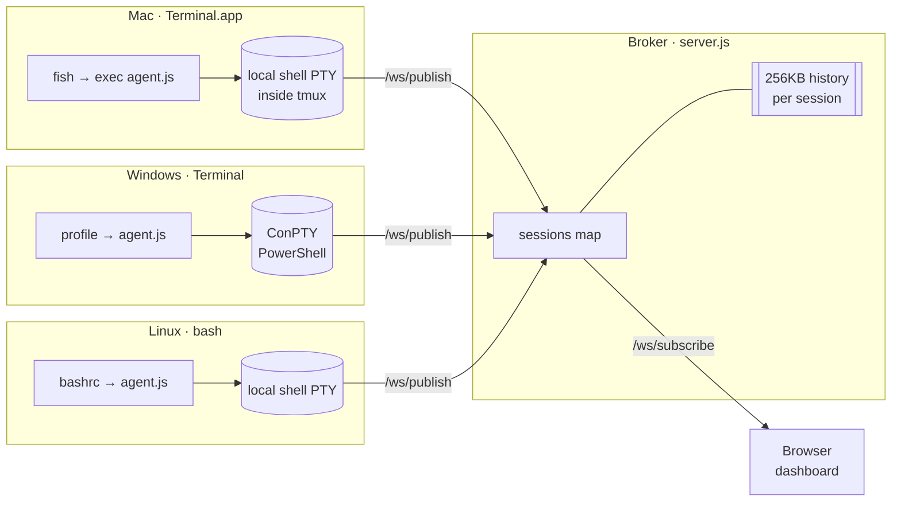

# term-hub

> **One web page. Every terminal you own, live and controllable.**

```
 ┌─────────┐      ┌─────────┐      ┌─────────┐
 │   Mac   │      │ Windows │      │  Linux  │   ← shells run here
 │ agent.js│      │ agent.js│      │ agent.js│
 └────┬────┘      └────┬────┘      └────┬────┘
      │  WS /ws/publish (raw PTY bytes) │
      └─────────────┬───────────────────┘
                    ▼
            ┌────────────────┐
            │  term-hub      │   ← one small broker,
            │  broker :7777  │     holds no shells
            └───────┬────────┘
                    │  WS /ws/subscribe
                    ▼
            ┌────────────────┐
            │    browser     │   ← you, on any device
            │   dashboard    │
            └────────────────┘
```

Every new Terminal window on Mac / PowerShell window on Windows / shell over SSH
on Linux is automatically registered to a central broker. Open `http://broker:7777`
from any device and you see them all — click one to mirror and control it in real
time. Offline-safe: if the broker is unreachable, the shells still run locally;
the agent reconnects in the background and backfills recent scrollback.

Built because I was tired of copy-pasting prompts between two Macs, a Linux box,
and a Windows desktop. Now the broker is a common workbench for all of them.

---

## Highlights

- **Central broker, distributed shells.** One tiny `server.js` hub. Each client
  machine runs `agent.js`, which owns its local shell PTY and publishes it.
- **Real bidirectional.** Type in the browser, it shows up on the machine. Type
  on the machine, it shows up in the browser. tmux handles local persistence,
  the agent handles the network.
- **Offline-safe, fully reconnecting.** Agent auto-reconnects to the broker
  every 3s with a 256KB pre-connect output buffer flushed on reconnect;
  browser tabs reconnect with exponential backoff; broker heartbeats every 30s
  kill zombie TCPs. Restart the broker mid-session — everyone finds each
  other again without you doing anything.
- **Multi-viewer.** Any number of browser tabs can subscribe to the same
  session; all mirror the same live stream with a 256KB replay buffer for
  late-joiners.
- **Zero build.** Vanilla Node, vanilla JS, xterm.js from a CDN. `npm install`
  and go.
- **Simple detach.** `Ctrl-]` then `q` in any agent-backed terminal cleanly
  detaches (and leaves the underlying tmux session alive on the host).

---

## How it works



Two WebSocket endpoints, two directions:

- **`/ws/publish?session=NAME&host=HOST`** — one agent per session, owns the PTY.
  Sends raw PTY bytes; receives keystrokes + resize events from viewers.
- **`/ws/subscribe?session=NAME`** — zero or more browser tabs. Each gets a
  history replay on attach, then live stream. Keystrokes ride back to the agent.

Session names are auto-picked per host: `mac-1`, `mac-2`, …, `claude-1`, …,
`win-1`, …. The agent asks local tmux for the next free name if available,
otherwise asks the broker.

---

## Quick start

### 1) Run the broker (one machine, typically your home server)

```bash
git clone https://github.com/quake0day/term-hub.git
cd term-hub
npm install
node server.js                     # listens on 0.0.0.0:7777
```

Open `http://<broker-host>:7777` — you'll see an empty dashboard and a hint.

Production-style (Linux systemd unit):

```ini
# /etc/systemd/system/term-hub.service
[Unit]
Description=term-hub broker
After=network.target

[Service]
User=you
WorkingDirectory=/home/you/term-hub
Environment=PORT=7777
ExecStart=/usr/bin/node /home/you/term-hub/server.js
Restart=on-failure

[Install]
WantedBy=multi-user.target
```

```bash
sudo systemctl enable --now term-hub
```

### 2) On each client, run the agent

**On the client too**, clone the repo and `npm install` (you need `node-pty`
and `ws`). Then wire your shell to auto-launch the agent on every new terminal.

#### macOS — fish

`~/.config/fish/conf.d/term-hub.fish`:

```fish
set -gx TERM_HUB_URL "http://<broker-host>:7777"
set -gx TERM_HUB_AGENT "$HOME/term-hub/agent.js"
set -gx TERM_HUB_PREFIX "mac"

if status is-interactive
    and not set -q TMUX
    and not set -q TERM_HUB_SKIP
    and not set -q SSH_CONNECTION
    and not set -q VSCODE_INJECTION
    and test -f $TERM_HUB_AGENT
    and type -q node
    exec node $TERM_HUB_AGENT $TERM_HUB_URL
end
```

#### Linux — bash

Append to `~/.bashrc`:

```bash
export TERM_HUB_URL=http://<broker-host>:7777
export TERM_HUB_AGENT="$HOME/term-hub/agent.js"
if [[ $- == *i* ]] && [[ -z "$TMUX" ]] && [[ -z "$TERM_HUB_SKIP" ]] \
   && [[ -f "$TERM_HUB_AGENT" ]] && command -v node >/dev/null; then
  exec node "$TERM_HUB_AGENT" "$TERM_HUB_URL"
fi
```

Optional `~/.tmux.conf` to keep the feel close to a native terminal:

```
set -g status off
set -g mouse on
set -g history-limit 50000
set -g window-size latest
setw -g aggressive-resize on
```

#### Windows — Windows Terminal profile

```powershell
winget install OpenJS.NodeJS.LTS
git clone https://github.com/quake0day/term-hub.git C:\term-hub
cd C:\term-hub
npm install
```

New Windows Terminal profile (set as default so every new tab registers):

```json
{
  "name": "Hub Shell",
  "commandline": "node.exe C:\\term-hub\\agent.js http://<broker-host>:7777",
  "startingDirectory": "%USERPROFILE%"
}
```

Each new window auto-picks `<hostname>-N` and streams to the hub. On Windows
there's no tmux, so the PTY lives inside `agent.js` itself; closing the
window ends the session.

### 3) Opt-out / manual control

```bash
TERM_HUB_SKIP=1 bash -i        # a shell that doesn't register with the hub
node agent.js <url> mac-42     # attach/resume a specific named session
```

Detach from an attached session with **`Ctrl-]` then `q`**. The session keeps
running locally (inside tmux if tmux is available).

---

## Dashboard

Open `http://<broker>:7777` in any browser reachable from your network.

- Left sidebar groups live sessions by host (e.g. `mac`, `claude`, `win`).
- Click a session → opens a tab with an `xterm.js` terminal attached to it.
- Multiple tabs on the same session? No problem — everyone sees the same stream.
- `✕` next to a session kills it (hub tells the agent to exit).

Opening a session triggers a history replay so you see recent scrollback,
then the stream goes live.

---

## Configuration reference

### Broker (`server.js`)

| Env var              | Default   | Notes                                       |
|----------------------|-----------|---------------------------------------------|
| `PORT`               | `7777`    | HTTP + WebSocket port                       |
| `HOST`               | `0.0.0.0` | Bind address                                |
| `TERM_HUB_HISTORY`   | `262144`  | Per-session history ring buffer (bytes)     |

### Agent (`agent.js`)

| Env var                 | Default                 | Notes                                             |
|-------------------------|-------------------------|---------------------------------------------------|
| `TERM_HUB_URL`          | `http://localhost:7777` | Broker to publish to                              |
| `TERM_HUB_SESSION`      | auto                    | Force a specific session name                     |
| `TERM_HUB_PREFIX`       | `<hostname>`            | Prefix used for auto-naming (`<prefix>-N`)        |
| `TERM_HUB_SKIP`         | _unset_                 | If set at agent start, exits silently             |
| `TERM_HUB_NO_TMUX`      | _unset_                 | Skip the tmux wrapper even if tmux is installed   |
| `TERM_HUB_AGENT_BUFFER` | `262144`                | Pre-connect output buffer size (bytes)            |

### HTTP / WebSocket API

| Method | Path                               | Purpose                                           |
|--------|------------------------------------|---------------------------------------------------|
| GET    | `/api/info`                        | Broker hostname, platform, session count          |
| GET    | `/api/sessions`                    | List of published sessions                        |
| POST   | `/api/sessions/:name/kill`         | Ask broker to tell the agent to exit              |
| WS     | `/ws/publish?session=N&host=H`     | Agent registers and owns a session (one at a time) |
| WS     | `/ws/subscribe?session=N`          | Browser / TUI attaches as a viewer                |

All HTTP responses send permissive CORS headers; the dashboard is static files
under `public/` and can be hosted anywhere.

---

## Security

**There is no authentication.** The broker trusts anything that can reach it.
Treat it like an internal tool — do not expose it to the open internet. Good
options for remote access:

- **[Tailscale](https://tailscale.com)** — private mesh VPN; the broker stays on
  a stable `100.x.x.x` address reachable from anywhere after one login.
- **[Cloudflare Tunnel + Access](https://developers.cloudflare.com/cloudflare-one/)** —
  public HTTPS hostname gated by SSO; no ports opened on your router.
- **SSH port-forward** — `ssh -L 7777:localhost:7777 home-host` — zero infra.

A token / basic-auth flag is on the roadmap. PRs welcome.

---

## Roadmap

- [ ] Shared-token / basic-auth gate + TLS flag
- [ ] Dashboard: split panes (watch several sessions side-by-side)
- [ ] Dashboard: broadcast-typing mode (send input to all open tabs)
- [ ] Agent → agent direct-mode fallback when broker is down
- [ ] Session history export (full scrollback as markdown)
- [ ] Tauri/Electron menu-bar app wrapper

---

## Layout

```
term-hub/
├── server.js          # Broker: pub/sub over WebSocket, history ring buffer
├── agent.js           # Client agent: local shell PTY + WS publisher
├── public/index.html  # Dashboard (vanilla JS + xterm.js, no build)
└── package.json
```

---

## License

MIT © quake0day
